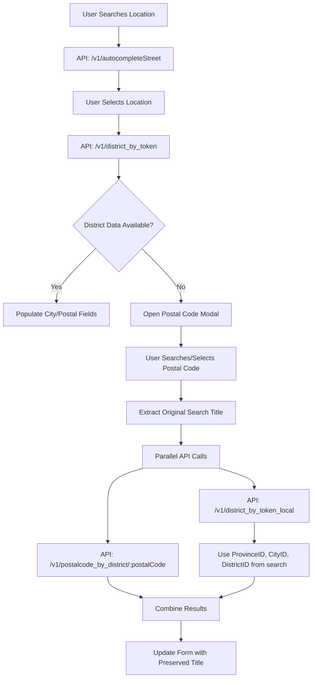
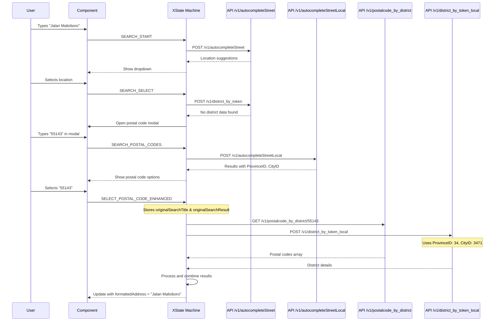

# LocationField Domestic - Enhanced Postal Code Selection

> **Quick Summary:** Compound component for Indonesian domestic location management with enhanced postal code selection flow. Uses XState state machine for complex state management and parallel API calls. Framework-agnostic. TypeScript. Production-ready.

---

## 🎯 What This Is

A comprehensive location input system specifically designed for Indonesian domestic locations with:

- **Autocomplete search** with Indonesian place suggestions
- **Enhanced postal code selection** with fallback handling
- **GPS/Geolocation** for current location
- **Reverse geocoding** (coordinates → address)
- **Smart API integration** with proper identifier usage

# Location Management (Domestic)

This module provides a robust, state-managed solution for handling Indonesian domestic location selection, including street autocomplete, place details, and an enhanced postal code selection system that uses proper identifiers from search results.

## 🌟 Key Features

- **XState Machine**: Deterministic state management for search, geocoding, and enhanced postal code selection
- **Framework Agnostic**: Integrates via simple `onLocationChange` callback. Works with `react-hook-form`, Redux, or local state
- **Autocomplete**: Indonesian-specific street search with debounce
- **Enhanced Postal Code Selection**:
  - Uses proper identifiers (`ProvinceID`, `CityID`, `DistrictID`) from search results
  - Parallel API calls to `/v1/postalcode_by_district/:postalCode` and `POST /v1/district_by_token_local`
  - Intelligent fallback when district data is unavailable
  - Preserves original search title for `formattedAddress`
- **Smart Formatted Address Mapping**: Preserves user's original search title instead of postal code
- **Stable References**: Optimized to prevent infinite render loops

## 📦 Components

The module exports a composite object `LocationFieldDomestic` with the following sub-components:

- **`Provider`**: The context provider that holds the state machine
- **`Input`**: The search input field with autocomplete dropdown
- **`PinPoint`**: Map component for visual location selection
- **`Address`**: Text area for manual address details
- **`City`**: Dropdown for city selection (dynamic options)
- **`PostalCode`**: Enhanced dropdown for postal code selection with search modal

## 🚀 Usage

### Basic Implementation with React Hook Form

```tsx
import LocationFieldDomestic, {
  useLocationFieldStateMachineContext,
} from "@/components/LocationManagement/Domestic";

const MyForm = () => {
  const { setValue } = useForm();

  return (
    <LocationFieldDomestic.Provider
      onLocationChange={(data) => {
        // Enhanced data = {
        //   city, cityId, district, districtId, province, provinceId,
        //   country, postalCode, address, formattedAddress, coordinates
        // }

        // 1. Update your form state with enhanced location data
        setValue("city", data.city);
        setValue("cityId", data.cityId);
        setValue("district", data.district);
        setValue("districtId", data.districtId);
        setValue("province", data.province);
        setValue("provinceId", data.provinceId);
        setValue("postalCode", data.postalCode);
        setValue("country", data.country);

        // 2. Map formattedAddress to your display field (preserves original search title)
        setValue("locationDisplay", data.formattedAddress);

        // 3. (Optional) Auto-fill coordinates
        if (data.coordinates) {
          setValue("latitude", data.coordinates.latitude);
          setValue("longitude", data.coordinates.longitude);
        }
      }}
    >
      <div className="flex flex-col gap-4">
        {/* Search Input */}
        <LocationFieldDomestic.Input placeholder="Cari lokasi di Indonesia..." />

        {/* Manual Address Detail */}
        <LocationFieldDomestic.Address placeholder="Masukkan alamat detail (Gedung, Lantai, dll)" />

        {/* Map Pin Point */}
        <LocationFieldDomestic.PinPoint />

        {/* Dynamic Selects */}
        <LocationFieldDomestic.City />
        <LocationFieldDomestic.PostalCode />
      </div>
    </LocationFieldDomestic.Provider>
  );
};
```

## 🔄 Enhanced Postal Code Selection Flow

### Flow Diagram



### Detailed Flow Explanation

#### 1. **Initial Location Search**
```
User types: "Jalan Malioboro, Yogyakarta"
    ↓
API Call: POST /v1/autocompleteStreet
    ↓
Response: Location suggestions with Title
    ↓
User selects: "Jalan Malioboro, Kota Yogyakarta"
    ↓
Store: tempLocationTitle = "Jalan Malioboro, Kota Yogyakarta"
```

#### 2. **Place Details Fetch**
```
API Call: POST /v1/district_by_token
    ↓
Response: Districts data or No District Data Found
    ↓
IF no district data → Open Postal Code Modal
```

#### 3. **Enhanced Postal Code Modal**
```
Modal opens with search capability
    ↓
User searches: "55143"
    ↓
API Call: POST /v1/autocompleteStreetLocal
    ↓
Response: {
  ProvinceID: 34,
  CityID: 3471,
  DistrictID: "347108",
  PostalCode: "55143",
  Description: "55143, Mantrijeron, Kota Yogyakarta"
}
```

#### 4. **Parallel API Execution**
```
User selects postal code "55143"
    ↓
Event: SELECT_POSTAL_CODE_ENHANCED
    ↓
Store:
  - originalSearchTitle = "Jalan Malioboro, Kota Yogyakarta"
  - originalSearchResult = {ProvinceID: 34, CityID: 3471, ...}
    ↓
Parallel API Calls:
  1. GET /v1/postalcode_by_district/55143
  2. POST /v1/district_by_token_local with proper identifiers
```

#### 5. **Smart Data Processing**
```typescript
// API 1: Postal codes by district
postalData = ["55141", "55142", "55143"]

// API 2: District details with proper identifiers
districtData = {
  coordinates: {lat: -7.8207, lng: 110.3646},
  info: {city: "Kota Yogyakarta", country: "Indonesia"},
  districtsData: [...]
}
```

#### 6. **Final Form Update**
```typescript
updatedSelectedLocation = {
  postalCode: "55143",
  formattedAddress: "Jalan Malioboro, Kota Yogyakarta", // Preserved original title!
  city: "Kota Yogyakarta",
  country: "Indonesia",
  coordinates: {lat: -7.8207, lng: 110.3646}
}
```

## 🛠️ API Reference

### Enhanced Postal Code APIs

#### `searchPostalCodes(query: string)`
Search postal codes with Indonesian location context
```typescript
// API: POST /v1/autocompleteStreetLocal
const results = await LocationAPIAdapter.searchPostalCodes("55143");
// Returns: [{title: "55143", provinceID: 34, cityID: 3471, ...}]
```

#### `fetchPostalCodeAndDistrictData(postalCode: string, searchResult?: any)`
Parallel API call for comprehensive postal code and district data
```typescript
const data = await LocationAPIAdapter.fetchPostalCodeAndDistrictData("55143", searchResult);
// Returns: {
//   postalCodes: PostalCodeListItem[],
//   districtsData: LocationDetails,
//   districtList: DistrictListItem[],
//   success: boolean,
//   errors: {...}
// }
```

### `LocationData` Interface

```typescript
interface LocationData {
  city?: string;
  cityId?: number;
  district?: string;
  districtId?: number;
  province?: string;
  provinceId?: number;
  country?: string;
  postalCode?: string;
  address?: string; // Raw address from API
  formattedAddress?: string; // Preserved original search title
  coordinates?: Coordinates;
}
```

## 📂 File Organization

```
LocationManagement/Domestic/
├── index.tsx                      # Main compound component exports
├── LocationFieldProvider.tsx      # XState machine + React provider
├── api-adapter.ts                 # API wrapper with enhanced postal code methods
├── types.ts                       # Clean TypeScript definitions
│
├── components/                    # Sub-components
│   ├── LocationFieldInput.tsx     # Autocomplete dropdown
│   ├── LocationFieldAddress.tsx   # Address textarea
│   └── LocationFieldPinPoint.tsx   # Map preview
│
├── modals/                        # Modal dialogs
│   ├── PostalCodeModal.tsx        # Enhanced postal code selection
│   └── LocationDetailModal.tsx    # Map with coordinate edit
│
└── utils/
    ├── locationConstants.ts       # Constants, error messages
    └── locationNormalizers.ts     # Data transformation utilities
```

## 🔄 How It Works (Data Flow)

### Enhanced Postal Code Selection Flow



## 🔌 API Integration Patterns

### Enhanced Postal Code Pattern

```typescript
// 1. Search postal codes with identifiers
const postalSuggestions = await LocationAPIAdapter.searchPostalCodes("55143");
// Returns rich data: {title: "55143", provinceID: 34, cityID: 3471, ...}

// 2. Fetch comprehensive data with proper identifiers
const comprehensiveData = await LocationAPIAdapter.fetchPostalCodeAndDistrictData(
  "55143",
  postalSuggestions[0] // Contains the identifiers
);

// 3. Smart identifier usage in district API
const districtPayload = {
  ProvinceID: searchResult.provinceID,  // 34 (from search)
  CityID: searchResult.cityID,          // 3471 (from search)
  DistrictID: searchResult.districtID,  // "347108" (from search)
  PostalCode: searchResult.postalCode   // "55143"
};
```

## 🎓 Key Implementation Details

### 1. XState Event Flow

```typescript
// Enhanced postal code selection event
SELECT_POSTAL_CODE_ENHANCED: {
  target: "loadingPostalCodeDetails",
  actions: assign(({ context, event }) => ({
    selectedPostalCode: event.postalCode,
    originalSearchTitle: event.originalTitle,      // Preserved original title
    originalSearchResult: event.originalSearchResult, // Rich identifier data
    selectedLocationData: event.locationData,
    activeModal: null, // Close modal immediately
  }))
}

// Parallel API execution state
loadingPostalCodeDetails: {
  invoke: {
    src: "fetchPostalCodeAndDistrictData",
    input: ({ context }) => ({
      postalCode: context.selectedPostalCode,
      searchResult: context.originalSearchResult // Pass identifiers
    }),
    onDone: {
      target: "idle",
      actions: assign(({ context, event }) => ({
        // Prioritize original search title for formattedAddress
        selectedLocation: {
          ...context.selectedLocation,
          formattedAddress: context.originalSearchTitle || "",
          // ... other location data
        }
      }))
    }
  }
}
```

### 2. Smart Title Preservation

```typescript
// In PostalCodeModal.tsx
const handleSelect = (postalCode: string) => {
  // Extract original title from context (preserved from initial search)
  const contextOriginalTitle = stateMachine.state?.context?.tempLocationTitle;

  // Extract rich identifier data from search result
  const originalSearchResult = selectedResult ? {
    provinceID: selectedResult.provinceID,
    cityID: selectedResult.cityID,
    districtID: selectedResult.districtID,
    postalCode: selectedResult.postalCode,
  } : undefined;

  // Pass both original title and identifier data
  handleEnhancedPostalCodeSelect(
    postalCode,
    contextOriginalTitle, // "Jalan Malioboro, Kota Yogyakarta"
    locationData,
    originalSearchResult  // {provinceID: 34, cityID: 3471, ...}
  );
};
```

### 3. Parallel API Execution with Fallback

```typescript
// In api-adapter.ts
fetchPostalCodeAndDistrictData: async (postalCode: string, searchResult?: any) => {
  try {
    // Always fetch postal codes first
    const postalData = await LocationAPIAdapter.getPostalCodesByDistrict(postalCode);

    // Use proper identifiers from search result if available
    let districtData = null;
    if (searchResult?.provinceID && searchResult?.cityID) {
      const districtPayload = {
        ProvinceID: searchResult.provinceID,
        CityID: searchResult.cityID,
        DistrictID: searchResult.districtID || postalCode,
        PostalCode: searchResult.postalCode || postalCode
      };
      districtData = await LocationAPIAdapter.getDistrictByTokenLocal(districtPayload);
    }

    return {
      postalCodes: postalData,
      districtsData: districtData,
      success: true,
      errors: { postalCode: null, district: null }
    };
  } catch (error) {
    // Smart fallback handling
    return {
      postalCodes: [],
      districtsData: null,
      success: false,
      errors: { postalCode: error.message, district: null }
    };
  }
}
```

## 🐛 Common Issues & Solutions

### Issue: formattedAddress shows postal code instead of original title

**Cause:** Original search title not properly preserved through the flow
**Fix:** Ensure `tempLocationTitle` is set during initial search and used in postal code selection

### Issue: District API call fails with invalid ProvinceID/CityID

**Cause:** Using placeholder zeros instead of proper identifiers from search results
**Fix:** Extract and use `ProvinceID`, `CityID`, `DistrictID` from `/v1/autocompleteStreetLocal` response

### Issue: Modal doesn't close after postal code selection

**Cause:** State machine transition not properly configured
**Fix:** Set `activeModal: null` in `SELECT_POSTAL_CODE_ENHANCED` action

### Issue: Only one API call being made

**Cause:** District API identifiers not being passed correctly
**Fix:** Update XState machine input to pass `originalSearchResult` to API adapter

## 🚀 Quick Start Checklist

When implementing enhanced postal code selection:

- [ ] Preserve original search title in `tempLocationTitle`
- [ ] Extract proper identifiers from `/v1/autocompleteStreetLocal`
- [ ] Use parallel API calls for postal code and district data
- [ ] Set `formattedAddress` to original title, not postal code
- [ ] Handle district API failures gracefully
- [ ] Close modal immediately on selection
- [ ] Test with various postal codes (with/without district data)

## 📚 Debug Information

### Debug Logging Prefixes

All enhanced postal code selection logs use `🏘️ POSTAL_DEBUG` prefix:

- `SELECT_POSTAL_CODE_ENHANCED`: Event triggered
- `Using search result identifiers`: District API using proper IDs
- `Setting formattedAddress with`: Shows title preservation logic
- `API calls completed`: Performance and success tracking

### Key Debug Points

```javascript
// Check these logs when debugging:
🏘️ POSTAL_DEBUG: Context tempLocationTitle: // Should show original search
🏘️ POSTAL_DEBUG: Original search result with IDs: // Should show ProvinceID/CityID
🏘️ POSTAL_DEBUG: District payload with proper identifiers: // Should use IDs not zeros
🏘️ POSTAL_DEBUG: Setting formattedAddress with: // Should use original title
🏘️ POSTAL_DEBUG: Final formattedAddress: // Should be preserved title
```

---

**Last Updated:** 2025-12-10
**Enhanced Features:** Smart Postal Code Selection with Identifier Preservation
**Pattern:** Compound Component + XState Machine + Parallel API Calls
**Language:** TypeScript